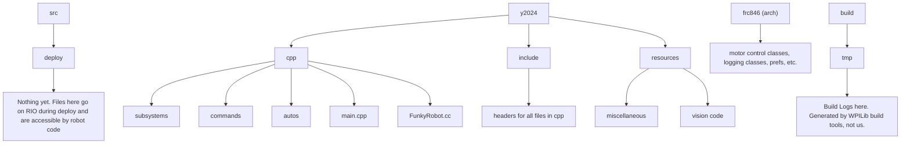

# 2025 Training

## General Project Structure

Code subsystems interact with hardware subsystems by: 1. writing to motors and 2. receiving sensor data.

Commands set targets to these subsystems. Some commands are like actions, such as moving the arm to a setpoint, or deploying the intake. Commands can be compounded to form more complex routines and autos.



## First Time Setup - Windows

### --Downloads--

#### WPILib Tools
- Download WPILib tools and WPILib VSCode. Attached are links for versions 2025.3.2.
    - [2025.3.2 WINDOWS](https://packages.wpilib.workers.dev/installer/v2025.3.2/Win64/WPILib_Windows-2025.3.2.iso)
    - [2025.3.2 MACOS ARM](https://packages.wpilib.workers.dev/installer/v2025.3.2/macOSArm/WPILib_macOS-Arm64-2025.3.2.dmg)
    - [2025.3.2 MACOS INTEL](https://packages.wpilib.workers.dev/installer/v2025.3.2/macOS/WPILib_macOS-Intel-2025.3.2.dmg)
- Once downloaded, double click on the file. By default, it will be saved in the downloads folder.
- Run the .exe file inside of it. It should be called "WPILib Installer".
- Go through the default setup process.
    - Install everything, NOT tools only.
    - When you get to the installation for WPILib VSCode, select "for this computer only".


#### Git
- Create a GitHub account (which you should already have if you can access this?).
    - If haven't already, send your username to me so I can add you to our organization. This allows you to modify/edit files.
- Download git-scm from [here](https://git-scm.com/download/win).
    - For most people, 64-bit standalone installer.
- Run the file downloaded. 
- Go through setup process.
    - If unsure, select default options.

If unfamiliar with GitHub, go through tutorials in the [Using Git](#using-git) section.

#### LLVM
- Download [LLVM](https://github.com/llvm/llvm-project/releases/download/llvmorg-18.1.8/LLVM-18.1.8-win64.exe)
    - Run the downloaded file, go through setup process.
- If "Add LLVM to Path" is an option during setup process, select YES.
    - If not, add ```C:\Program Files\LLVM\bin``` to PATH
    - Read [this](https://stackoverflow.com/questions/44272416/how-to-add-a-folder-to-path-environment-variable-in-windows-10-with-screensho) for more information on adding files to PATH.

#### CppCheck
- Download [CppCheck](https://sourceforge.net/projects/cppcheck/files/1.86/cppcheck-1.86-x64-Setup.msi/download).
- If "Add CppCheck to Path" is an option during setup process, select YES.
    - If not, add ```C:\Program Files\Cppcheck``` to PATH
    - Read [this](https://stackoverflow.com/questions/44272416/how-to-add-a-folder-to-path-environment-variable-in-windows-10-with-screensho) for more information on adding files to PATH.

### --Setup--
- Clone the repository.
    - Run: ```git clone https://github.com/Team846/2025-training.git``` in terminal.
- Open WPILib VSCode
- In WPILib VSCode, open the folder containing the cloned repository.
    - The path will be ```path the clone command was run in + howler_monkey```
- DO NOT change the gradle file. If WPILib VSCode prompts an update to the gradle file, click CANCEL.
- Click on the WPILib icon (the W in the top right corner).
- In the dropdown list, click on ```C++: Refresh C++ Intellisense```.
- If it succeeds, the code has been successfully setup on your computer. 
- Read the [First Build](#first-build) section.

Deploying:
- When trying to deploy the code to the robot, connect to the robot using either an ethernet cable or by connecting to the radio's network.
- Then, run 'Deploy robot code'.

## First Time Setup - MacOS

Read through the setup process on Windows. This section will only outline the differences. You may need to install [homebrew](https://brew.sh/).

### --Downloads--

Select x64 or arm depending on your chip. If using an Apple Silicon (M1,M2, etc.) mac, select arm.

Ignore the LLVM section.

- [WPILib 2025.3.2](https://github.com/wpilibsuite/allwpilib/releases/tag/v2025.3.2).
- [git-scm](https://git-scm.com/download/mac).
- Clang-format: ```brew install clang-format```
- CppCheck: ```brew install cppcheck```


### --Setup--

WPILib VSCode is installed in a hard-to-find directory on MacOS. It is usually located in ~/wpilib/202x/vscode/ and is called "Visual Studio Code". For example it can be located in /Users/funkymonkey/wpilib/2025/vscode. If you need help finding it, ask someone who has previously installed WPILib VSCode on MacOS.

It is a good idea to rename the file or move it into your Applications folder and pin it in dock for easy access and differentiation from normal VSCode.

WPILib VSCode will have a W icon in the top right corner, wherease normal VSCode will not.

## First Build

- Click on the WPILib icon in the top right corner of WPILib VSCode.
- Click ```WPILib: Build Robot Code```.
- If the code fails to build, it is most likely your fault. Fix the code you changed.
- If you didn't change anything, then ask me for help.

A first build can take over 10 minutes. Subsequent builds should be under 5 minutes.

## Deploying Code to the Robot

- Get permission from a Software Lead.
- Connect to the robot's network or connect directly using an ethernet cable.
- Run ```WPILib: Deploy Robot Code```.
- Do not disconnect, stop, or power-cycle the robot for any reason during the deploy. This may damage the RoboRIO.

## Using Git
- [What is Git?](https://www.w3schools.com/git/git_intro.asp?remote=github)
- [Configure](https://www.w3schools.com/git/git_getstarted.asp?remote=github)
    - Only read the "Configure Git" section
- [Commits](https://www.w3schools.com/git/git_commit.asp?remote=github)
- [Branches](https://www.w3schools.com/git/git_branch.asp?remote=github)
- [Branch merging](https://www.w3schools.com/git/git_branch_merge.asp?remote=github)
    - Not as important as the other ones

I have old code, I need to update it: 
- ```git pull```

I have new code which has been verified by a Software Lead. I need to give others access to it:
- ```git add .``` <-- The "." means all files
- ```git commit -am EXAMPLE_COMMIT_MESSAGE```
- ```git push```

I need to switch to a branch:
- ```git checkout -b NAME_OF_BRANCH``` <-- to create a new branch
- ```git checkout NAME_OF_BRANCH``` <-- to switch to an existing branch

I need to go back to a previous commit:
- ```git log```
- Press SPACE to scroll down and Q (lowercase) to exit.
- Find the hash (the random series of characters/numbers) for the commit you want.
- ```git checkout HASH```

To undo the going back:
- ```git switch -``` <-- goes back to latest commit

## CppCheck Warnings
```
src/frc846/cpp/frc846/math/collection.cc:25:0: warning: The function 'VerticalDeadband' is never used. [unusedFunction]
src/frc846/cpp/frc846/math/collection.cc:52:0: warning: The function 'CoterminalSum' is never used. [unusedFunction]
src/frc846/cpp/frc846/math/collection.cc:65:0: warning: The function 'modulo' is never used. [unusedFunction]
```